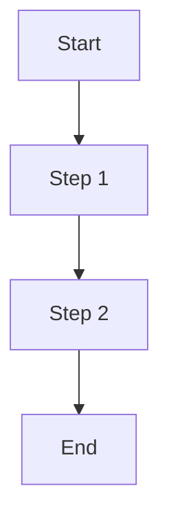

## Introduction

This is **bold** text, and this is *emphasized* text.

## Lists

### Ordered List
1. First item
2. Second item
3. Third item

### Unordered List
- Item A
- Item B
  - Sub-item B1
  - Sub-item B2

## Code Block

```python
# Python example
def hello_world():
    print("Hello, World!")
```

## Blockquote

> "This is a blockquote. Markdown is awesome!" - Someone

## Table

| Column 1 | Column 2 | Column 3 |
|----------|----------|----------|
| Row 1    | Data 1   | Data 2   |
| Row 2    | Data 3   | Data 4   |

## Image


## Equation

Inline equation: \( E = mc^2 \)

Block equation:

$$
\int_a^b f(x) \,dx = F(b) - F(a)
$$

## Diagram



## Horizontal Rule

---

## Task List

- [x] Task 1
- [ ] Task 2
- [ ] Task 3